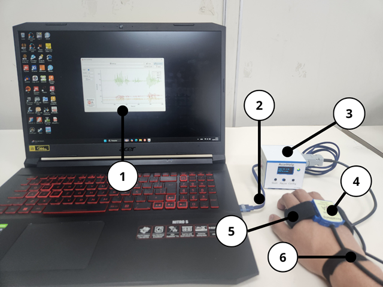

# 📦 AccelHelp

**AccelHelp** es un sistema portátil diseñado para adquirir señales de acelerómetro en aplicaciones de investigación o educativas. Su diseño combina hardware compacto con una interfaz sencilla para la captura, visualización y análisis de datos en línea.


AccelHelp está disponible como un **producto físico listo para usar**, con soporte técnico personalizado y documentación completa.

📲 **¿Quieres adquirir el dispositivo?**

Solicita un dispositivo directamente por [**WhatsApp**.](https://wa.me/593979287659?text=Hola%21+Deseo+adquirir+el+dispositivo+%2AAccelHelp)

---

## 🚀 Características destacadas

- ✅ Captura en línea de señales de acelerómetro de 3 ejes.
- 🛠️ Visualización y registro con el software **SerialHelp**.
- 💾 Almacenamiento de datos en archivos `.txt` para análisis posterior.
- 🧪 Scripts para análisis en **Matlab, Octave y Python**.
- 🩹 Fijación con velcro: instalación rápida y no invasiva.



---

## Tecnologías utilizadas

### Software:
- [SerialHelp](https://github.com/estudiosma/serialhelp)

### Hardware:
- Microcontrolador **ESP32** con interfaz Serial-USB.
- Acelerómetro de 3 ejes **MPU-6050**.
- Puerto USB.

---

## 🔌 Guía rápida de conexión

1. Conecta **AccelHelp** a tu PC usando el cable USB.
2. Abre el **Administrador de dispositivos** y localiza el puerto `USB-SERIAL CH340`.
3. Ejecuta el software **SerialHelp**.
4. Si no se conecta automáticamente, ve a:  
`Settings → Search for Port → Select COM → Save`.

---

## 📊 Análisis de datos con Matlab/Octave

El proyecto incluye scripts para importar y graficar las señales:

```matlab
addpath('ma_functions'); % descargar aquí: https://github.com/estudiosma/matlab
data = readmatrix('test.txt');
fs = 50; % Frecuencia de muestreo en Hz
t = (0:length(data)-1)/fs;
data_d = ma_detrend(data, 1);
ma_fft_plot(data_d, fs);
plot(t, data_d);
legend("AccX", "AccY", "AccZ");
```


## Créditos y atribución

Este proyecto fue desarrollado por **Estudios MA**, enfocado en sistemas de adquisición biomédica y análisis de señales.

Si utilizas este código, hardware o documentación como parte de tu proyecto personal o académico, **por favor referencia:**

Estudios MA, Molina-Vidal, D.A (2025). AccelHelp. Disponible en línea: https://github.com/estudiosma/AccelHelp

## ✍️ Autor

**Estudios MA – Ingeniería Electrónica y Biomédica**  
Ing. Danilo Molina, M.Sc  
🌐 [https://linkfly.to/EstudiosMA](https://linkfly.to/EstudiosMA)
