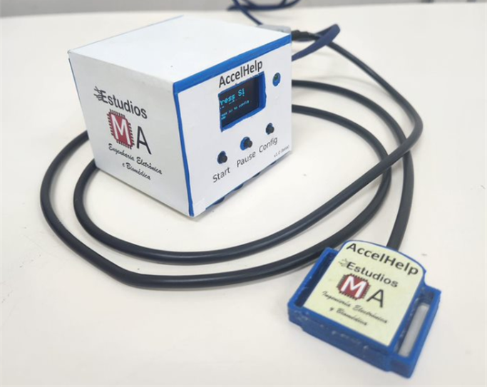

# 📦 AccelHelp

**AccelHelp** es un sistema portátil diseñado para adquirir señales de acelerómetro en aplicaciones biomédicas, educativas o de investigación. Su diseño combina hardware compacto con una interfaz sencilla para capturar, visualizar y analizar datos online.



AccelHelp está disponible como **producto físico listo para usar**, con soporte técnico personalizado y documentación completa.

📲 **¿Deseas adquirir el dispositivo?**  

Solicita un dispositivo directamente por [**WhatsApp aquí**](https://wa.me/593979287659?text=Hola%21+Deseo+adquirir+el+dispositivo+%2AAccelHelp)

---

## 🚀 Características destacadas

- ✅ Captura online de señales de acelerómetro de 3 ejes.
- 🛠️ Visualización y grabación con el software **SerialHelp**.
- 💾 Registro de datos en archivos `.txt` para posterior análisis.
- 🧪 Scripts para análisis en **Matlab / Octave**.
- 🩹 Sujeción con velcro: instalación rápida y no invasiva.


---

## Tecnologías utilizadas

### Software:
- [SerialHelp](https://github.com/estudiosma/serialhelp)

### Hardware:
- Microcontrolador **ESP32** con interfaz Serial-USB.
- Acelerómetro de 3 ejes **MPU-6050**.
- Puerto USB.

---

## 🔌 Guía rápida de conexión

1. Conecta **AccelHelp** al PC mediante el cable USB.
2. Abre el **Administrador de dispositivos** y localiza el puerto `USB-SERIAL CH340`.
3. Ejecuta el software **SerialHelp**.
4. Si no se conecta automáticamente, ve a:
   `Settings → Buscar puerto → Seleccionar COM → Save`.

---

## 📊 Análisis de datos con Matlab/Octave

El proyecto incluye scripts para importar y graficar las señales:

```matlab
addpath('ma_functions'); % download here: https://github.com/estudiosma/matlab
data = readmatrix('test.txt');
fs = 50; % Frecuencia de muestreo en Hz
t = (0:length(data)-1)/fs;
data_d = ma_detrend(data, 1);
ma_fft_plot(data_d, fs);
plot(t, data_d);
legend("AccX", "AccY", "AccZ");
```


## Créditos y atribución

Este proyecto fue desarrollado por **Estudios MA**, con enfoque en sistemas de adquisición biomédicos y análisis de señales.

Si usas este código, hardware o documentación como parte de tu proyecto personal o académico, **por favor referencia:**

Molina-Vidal, D.A., Estudios MA (2025). AccelHelp. Available online: https://github.com/estudiosma/AccelHelp.

## ✍️ Autor

**Estudios MA – Electronic and Biomedical Engineering**  
Eng. Danilo Molina, M.Sc  
📧 estudiosma01@gmail.com  
🌐 [https://linkfly.to/EstudiosMA](https://linkfly.to/EstudiosMA)