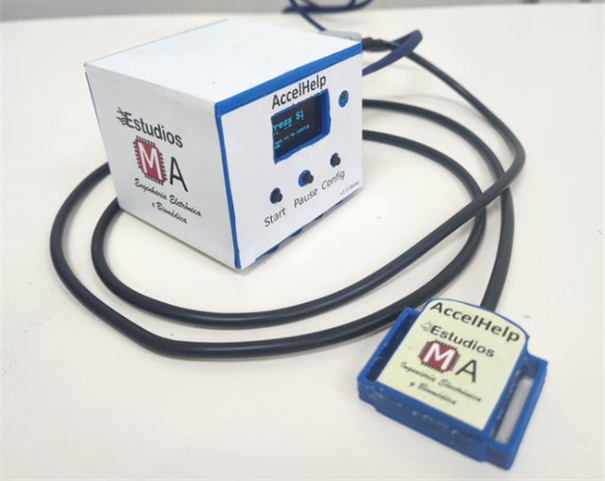
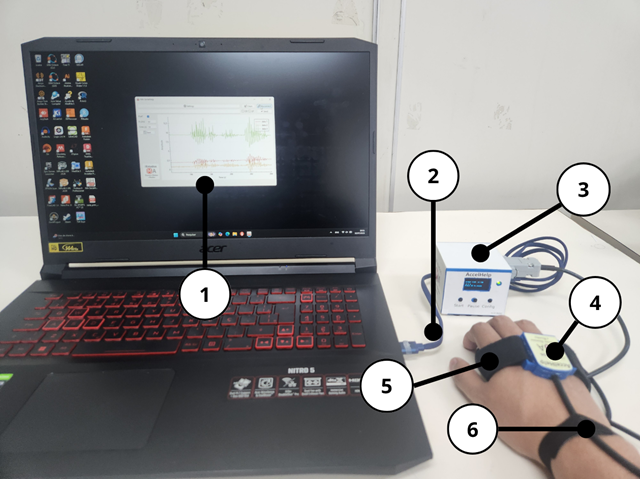
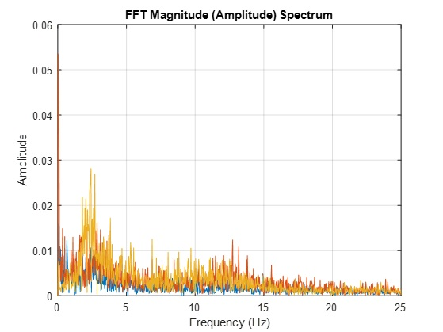

# 📦 AccelHelp

**AccelHelp** é um sistema portátil projetado para adquirir sinais de acelerômetro em aplicações de pesquisa ou educação. Seu design combina hardware compacto com uma interface simples para captura, visualização e análise de dados on-line.



AccelHelp está disponível como um **produto físico pronto para uso**, com suporte técnico personalizado e documentação completa.

📲 **Quer adquirir o dispositivo?**

Solicite um dispositivo diretamente pelo [**WhatsApp**.](https://wa.me/593979287659?text=Ol%C3%A1%21+Desejo+adquirir+o+dispositivo+%2AAccelHelp)

---

## 🚀 Funcionalidades em destaque

- ✅ Captura on-line de sinais de acelerômetro de 3 eixos.
- 🛠️ Visualização e gravação com o software **SerialHelp**.
- 💾 Armazenamento de dados em arquivos `.txt` para análise posterior.
- 🧪 Scripts para análise em **Matlab, Octave e Python**.
- 🩹 Fixação com velcro: instalação rápida e não invasiva.



---

## Tecnologias utilizadas

### Software:
- [SerialHelp](https://github.com/estudiosma/serialhelp)

### Hardware:
- Microcontrolador **ESP32** com interface Serial-USB.
- Acelerômetro de 3 eixos **MPU-6050**.
- Porta USB.

---

## 🔌 Guia rápido de conexão

1. Conecte o **AccelHelp** ao seu PC usando o cabo USB.
2. Abra o **Gerenciador de Dispositivos** e localize a porta `USB-SERIAL CH340`.
3. Execute o software **SerialHelp**.
4. Se não conectar automaticamente, acesse:  
`Settings → Search for Port → Select COM → Save`.

---

## 📊 Análise de dados com Matlab/Octave

O projeto inclui scripts para importar e plotar os sinais:

```matlab
addpath('ma_functions'); % baixe aqui: https://github.com/estudiosma/matlab
data = readmatrix('test.txt');
fs = 50; % Frequência de amostragem em Hz
t = (0:length(data)-1)/fs;
data_d = ma_detrend(data, 1);
ma_fft_plot(data_d, fs);
plot(t, data_d);
legend("AccX", "AccY", "AccZ");
```



## Créditos e atribuição

Este projeto foi desenvolvido por **Estudios MA**, com foco em sistemas de aquisição biomédica e análise de sinais.

Se você utilizar este código, hardware ou documentação como parte de seu projeto pessoal ou acadêmico, **por favor, referencie:**

Estudios MA, Molina-Vidal, D.A (2025). AccelHelp. Disponível online: https://github.com/estudiosma/AccelHelp

## ✍️ Autor

**Estudios MA – Engenharia Eletrônica e Biomédica**  
Eng. Danilo Molina, M.Sc  
🌐 [https://linkfly.to/EstudiosMA](https://linkfly.to/EstudiosMA)
